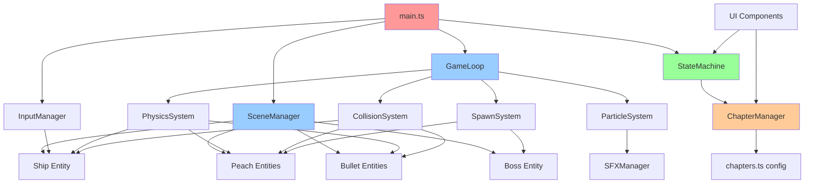

I have created the following plan after thorough exploration and analysis of the codebase. Follow the below plan verbatim. Trust the files and references. Do not re-verify what's written in the plan. Explore only when absolutely necessary. First implement all the proposed file changes and then I'll review all the changes together at the end.

## Observations

The project is currently a greenfield setup with only documentation files (`file:AGENTS.md` and `file:MASTER_PLAN.md`). Part 1 aims to deliver a polished vertical slice featuring Chapter 1 with a boss fight, proving the core arcade shooter mechanics, procedural peach aesthetics, and campaign pipeline. The tech stack is locked: Vite + TypeScript + Three.js with orthographic 2.5D rendering, custom lightweight physics, DOM/CSS UI, and WebAudio for procedural SFX.

## Approach

The plan follows a bottom-up implementation strategy, starting with foundational infrastructure (project scaffold, game loop, state management) before layering gameplay systems (ship controls, peaches, combat), then adding campaign structure and boss mechanics, and finally polishing with juice effects and audio. This ensures each layer is testable before building the next, reducing integration risk and enabling early playability testing.

---

## Implementation Plan

### **Phase 1: Foundation & Infrastructure**

#### 1.1 Project Scaffold
- Initialize a new Vite + TypeScript project with `npm create vite@latest`
- Configure `tsconfig.json` with strict mode enabled
- Install Three.js (`three`) as the primary dependency
- Set up basic project structure:
  ```
  src/
    ├── main.ts          (entry point)
    ├── core/            (game loop, state machine, time)
    ├── entities/        (ship, peaches, bullets, boss)
    ├── systems/         (physics, collision, pooling)
    ├── rendering/       (Three.js scene, camera, materials)
    ├── input/           (keyboard, touch handlers)
    ├── audio/           (WebAudio SFX)
    ├── ui/              (DOM overlays)
    └── config/          (chapters, constants, tuning)
  ```
- Create `index.html` with a canvas element and DOM overlay containers for UI
- Add npm scripts: `dev`, `build`, and placeholder for `export:single`

#### 1.2 Core Game Loop
- Implement fixed-timestep game loop in `src/core/GameLoop.ts`:
  - Use `requestAnimationFrame` for rendering
  - Accumulator pattern for fixed physics updates (60Hz target)
  - Separate `update(dt)` and `render(alpha)` phases
- Create `src/core/Time.ts` utility for delta time, elapsed time, and pause state
- Build lightweight state machine in `src/core/StateMachine.ts`:
  - States: `LOADING`, `MENU`, `PLAYING`, `PAUSED`, `CHAPTER_TRANSITION`, `GAME_OVER`, `VICTORY`
  - State transition hooks for enter/exit logic

#### 1.3 Three.js Scene Setup
- Initialize Three.js scene in `src/rendering/SceneManager.ts`:
  - Orthographic camera with configurable frustum (e.g., -10 to 10 units)
  - Black background with subtle star field (simple point sprites)
  - Ambient + directional lighting for peach materials
- Implement responsive resize handling that maintains aspect ratio
- Create camera wrapper with screen-to-world and world-to-screen coordinate conversion utilities

```mermaid
sequenceDiagram
    participant Main as main.ts
    participant Loop as GameLoop
    participant State as StateMachine
    participant Scene as SceneManager
    participant Input as InputManager
    
    Main->>Scene: Initialize Three.js scene
    Main->>Input: Setup keyboard/touch handlers
    Main->>State: Set initial state (LOADING)
    Main->>Loop: Start game loop
    
    loop Every Frame
        Loop->>Loop: Calculate delta time
        Loop->>State: Update current state
        State->>Loop: Execute state logic
        Loop->>Scene: Render scene
    end
```

---

### **Phase 2: Player Ship & Controls**

#### 2.1 Ship Entity
- Create `src/entities/Ship.ts` with:
  - Position, velocity, rotation properties
  - Inertia-based movement with damping (tunable constants in `src/config/tuning.ts`)
  - Max speed clamping
  - Screen-wrap logic (teleport to opposite edge)
  - Forgiving circular hit radius (smaller than visual size)
  - Invulnerability state with blink timer for respawn
- Render ship as a simple triangular mesh (Three.js `BufferGeometry`)
- Add thruster visual indicator (small triangle at back that scales with thrust input)

#### 2.2 Input System
- Implement `src/input/InputManager.ts`:
  - Keyboard: Arrow keys or WASD for rotation/thrust, Space for fire
  - Touch: Create DOM overlay buttons in `src/ui/MobileControls.ts`
    - Left/right rotation buttons (bottom-left)
    - Thrust button (bottom-right)
    - Fire button (bottom-right, separate)
  - Expose clean API: `isThrusting()`, `getRotationInput()`, `isFiring()`
- Add input buffering for responsive feel (1-2 frame buffer)

#### 2.3 Ship Physics Integration
- Create `src/systems/PhysicsSystem.ts`:
  - Apply thrust force based on ship rotation
  - Update velocity with damping factor each frame
  - Clamp velocity to max speed
  - Update position from velocity
  - Handle screen-wrap boundary checks
- Tune constants (thrust force, damping, max speed, rotation speed) in `src/config/tuning.ts` for arcade feel

---

### **Phase 3: Core Peaches**

#### 3.1 Peach Entity & Pooling
- Create `src/entities/Peach.ts`:
  - Size enum: `LARGE`, `MEDIUM`, `SMALL`
  - Position, velocity, rotation properties
  - Circular collision radius based on size
  - Split behavior: spawn 2 smaller peaches with diverging velocities
- Implement object pooling in `src/systems/ObjectPool.ts`:
  - Generic pool class with `acquire()` and `release()` methods
  - Pre-allocate pools for peaches (50), bullets (100), particles (500)

#### 3.2 Procedural Peach Material
- Create `src/rendering/PeachMaterial.ts`:
  - Use Three.js `ShaderMaterial` or `MeshStandardMaterial` with custom texture
  - Generate procedural texture via canvas 2D context:
    - Radial gradient (orange center to peachy-pink edge)
    - Perlin/simplex noise for fuzz texture (or simple random dots)
    - Glossy specular highlight (white spot offset from center)
  - Apply texture to sphere geometry (Three.js `SphereGeometry`)
- Use GPU instancing (`InstancedMesh`) for rendering multiple peaches efficiently
- Store per-instance data: position, rotation, scale (size-dependent)

#### 3.3 Peach Spawning & Behavior
- Create `src/systems/SpawnSystem.ts`:
  - Wave-based spawning logic (configurable count per wave)
  - Spawn peaches at screen edges with random inward velocity
  - Avoid spawning too close to player ship
- Implement drift behavior: constant velocity with screen-wrap
- Add gentle rotation animation for visual interest

---

### **Phase 4: Combat & Collision**

#### 4.1 Bullet System
- Create `src/entities/Bullet.ts`:
  - Position, velocity, time-to-live (TTL) properties
  - Small circular collision radius
  - Simple line or small sphere visual
- Implement bullet firing in ship:
  - Cooldown timer (tunable fire rate)
  - Spawn bullet at ship nose with velocity = ship velocity + bullet speed
  - Pool bullets for performance
- Update bullets each frame: move, decrement TTL, despawn when expired

#### 4.2 Collision Detection
- Implement `src/systems/CollisionSystem.ts`:
  - Circle-vs-circle collision detection (distance < radius1 + radius2)
  - Check bullet-peach collisions:
    - On hit: despawn bullet, split peach (or destroy if SMALL)
  - Check ship-peach collisions:
    - On hit: damage ship, trigger respawn with invulnerability
  - Use spatial partitioning (simple grid) if performance becomes an issue

#### 4.3 Lives & Respawn
- Add lives counter to game state (start with 3)
- On ship death:
  - Decrement lives
  - If lives > 0: respawn at center with 2-second invulnerability blink
  - If lives == 0: transition to `GAME_OVER` state
- Render lives as small ship icons in top-left corner (DOM overlay)

---

### **Phase 5: Chapter System**

#### 5.1 Chapter Configuration
- Create `src/config/chapters.ts`:
  - Array of chapter configs with:
    - `id`, `name`, `subtitle` (surreal one-liner)
    - `waveCount`, `enemyTypes`, `backgroundTint`
    - `musicCue` (placeholder string for now)
    - `boss` reference (for Chapter 1: `MegaPeach`)
- Implement chapter progression logic in `src/core/ChapterManager.ts`:
  - Track current chapter, current wave
  - Advance wave when all enemies cleared
  - Trigger boss fight after final wave
  - Transition to next chapter after boss defeated

#### 5.2 Chapter Transitions
- Create `src/ui/ChapterCard.ts` (DOM overlay):
  - Fade in chapter title + subtitle
  - Display for 3 seconds, then fade out
  - Transition from `CHAPTER_TRANSITION` to `PLAYING` state
- Add simple between-chapter reward screen:
  - Show score, combo stats
  - Restore 1 life (if < max)
  - "Press Space to Continue" prompt

#### 5.3 Wave System
- Implement wave spawning in `SpawnSystem`:
  - Read wave config from current chapter
  - Spawn peaches in patterns (e.g., ring, line, scattered)
  - Track active enemies; trigger wave complete when all destroyed
- Display wave counter in UI (e.g., "Wave 3/5")

---

### **Phase 6: Boss Fight (Mega Peach)**

#### 6.1 Boss Entity
- Create `src/entities/bosses/MegaPeach.ts`:
  - Large central body (3x normal peach size)
  - Phase state machine: `PHASE_A`, `PHASE_B`, `DEFEATED`
  - Health bar (render in DOM overlay)
  - Invulnerability flag (toggled during phase transitions)

#### 6.2 Phase A: Pit Satellites
- Spawn 6-8 orbiting "pit" satellites around boss:
  - Circular orbit with constant angular velocity
  - Each pit is a small destructible entity
  - Boss core is invulnerable while pits exist
- Player must destroy all pits to expose core
- Pits shoot slow-moving seeds at player (simple homing or straight-line)

#### 6.3 Phase B: Core Exposed
- After all pits destroyed:
  - Boss core becomes vulnerable
  - Attack pattern 1: Pulse gravity waves (visual ring expanding outward, pushes player)
  - Attack pattern 2: Seed barrage (spray of bullets in radial pattern)
  - Vulnerability window: 2-second pause after each attack
- Boss defeated when health reaches 0
- Trigger victory animation: boss implodes with particle burst

#### 6.4 Boss Integration
- Add boss trigger in `ChapterManager`: spawn boss after final wave
- Transition to boss-specific UI state (show health bar, hide wave counter)
- On boss defeat: transition to chapter complete screen, then next chapter (or victory if final chapter)

---

### **Phase 7: Juice & Polish**

#### 7.1 Particle System
- Create `src/rendering/ParticleSystem.ts`:
  - Use Three.js `Points` with `PointsMaterial` or instanced quads
  - Particle properties: position, velocity, lifetime, color, size
  - Pool particles for performance
- Implement particle effects:
  - **Peach split burst**: 10-15 orange/pink particles with outward velocity
  - **Juice droplets**: smaller, slower particles with gravity
  - **Bullet impact**: small white spark
  - **Thruster plume**: continuous stream of fading particles behind ship

#### 7.2 Visual Feedback
- Add micro hit-pause (freeze frame for 50ms on peach split)
- Implement subtle screen shake in `SceneManager`:
  - Camera offset with decay (triggered on damage, boss attacks)
  - Tunable intensity and duration
- Add trails:
  - **Ship trail**: fading line renderer or particle trail
  - **Bullet trail**: short fading line
- Implement invulnerability blink: toggle ship visibility every 100ms

#### 7.3 Post-Processing
- Add Three.js `EffectComposer` with passes:
  - **Bloom pass**: glow on bright elements (peaches, bullets, particles)
  - **Vignette**: subtle darkening at screen edges
  - Optional: chromatic aberration (very subtle)
- Make effects toggleable via settings (for performance/accessibility)

#### 7.4 WebAudio SFX
- Create `src/audio/SFXManager.ts`:
  - Initialize WebAudio context
  - Procedural sound generation using oscillators + filters
- Implement core sounds:
  - **Thrust**: continuous white noise with low-pass filter
  - **Bullet fire**: short high-pitched beep (sine wave)
  - **Peach split**: squelchy sound (filtered noise burst)
  - **Ship damage**: harsh buzz (sawtooth wave)
  - **Boss hit**: deep thud (low sine + noise)
- Add volume controls and mute toggle in settings

---

### **Phase 8: UI & Menus**

#### 8.1 HUD
- Create `src/ui/HUD.ts` (DOM overlay):
  - Top-left: Lives icons, score
  - Top-right: Wave counter (or boss health bar)
  - Bottom: Mobile controls (if touch detected)
- Style with CSS: clean, readable font; semi-transparent backgrounds; neon accent colors

#### 8.2 Menu Screens
- Implement `src/ui/MenuScreen.ts`:
  - Title screen with "Start Game" button
  - Settings panel: volume sliders, quality toggle, control remapping
  - Pause menu: resume, restart, quit to menu
- Implement `src/ui/GameOverScreen.ts`:
  - Display final score, stats
  - "Retry" and "Main Menu" buttons
- Implement `src/ui/VictoryScreen.ts`:
  - Congratulations message
  - Final stats, time to complete
  - "Play Again" button

#### 8.3 Responsive Layout
- Use CSS media queries for mobile vs desktop layouts
- Ensure touch controls are in thumb-friendly zones (bottom corners)
- Test on various screen sizes and aspect ratios

---

### **Phase 9: Export & Deployment**

#### 9.1 Web Build
- Run `npm run build` to generate production bundle
- Test build locally with `npm run preview`
- Optimize assets: minify code, compress textures (if any external assets added)

#### 9.2 Single-File Arcade Export
- Create `scripts/export-single.js`:
  - Inline all JS/CSS into a single `index.html`
  - Embed base64-encoded assets (if any)
  - Output to `dist/arcade/index.html`
- Add `export:single` npm script
- Test single-file build: should run offline without server

#### 9.3 Performance Validation
- Profile on desktop: target 60fps
- Profile on mid-range mobile device: target 45-60fps
- Add quality settings if performance issues arise:
  - Reduce particle count
  - Disable post-processing
  - Lower instancing counts

---

## Summary Table

| Phase | Key Deliverables | Dependencies |
|-------|-----------------|--------------|
| 1. Foundation | Project scaffold, game loop, Three.js scene | None |
| 2. Ship & Controls | Player ship, keyboard/touch input, physics | Phase 1 |
| 3. Core Peaches | Peach entities, procedural materials, pooling | Phase 1 |
| 4. Combat | Bullets, collision detection, lives system | Phase 2, 3 |
| 5. Chapter System | Chapter configs, wave spawning, transitions | Phase 4 |
| 6. Boss Fight | Mega Peach boss with 2 phases | Phase 5 |
| 7. Juice & Polish | Particles, trails, screen shake, SFX | Phase 6 |
| 8. UI & Menus | HUD, menus, responsive layout | Phase 7 |
| 9. Export | Web build, single-file export | Phase 8 |

---

## Architecture Diagram

