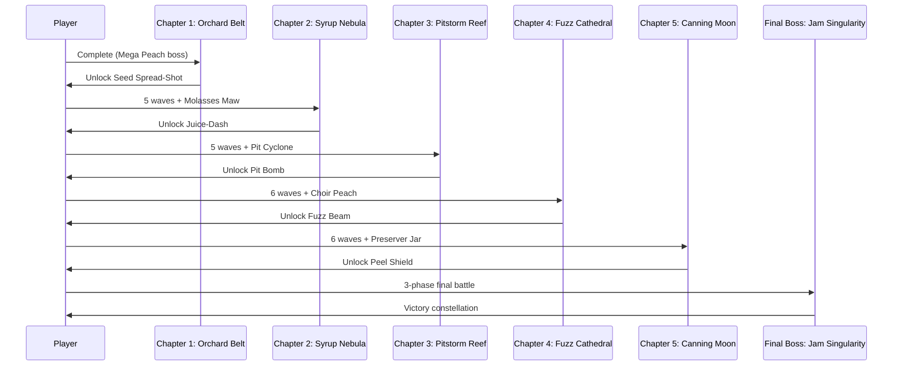

I have created the following plan after thorough exploration and analysis of the codebase. Follow the below plan verbatim. Trust the files and references. Do not re-verify what's written in the plan. Explore only when absolutely necessary. First implement all the proposed file changes and then I'll review all the changes together at the end.

# Part 2 Implementation Plan — 5-Chapter Campaign

## Observations

Part 1 has delivered a polished vertical slice with Chapter 1, Mega Peach boss, core ship mechanics, procedural peach materials, collision system, particle effects, and WebAudio SFX. The foundation includes a working game loop, state machine, Three.js orthographic scene, object pooling, and mobile controls. Part 2 expands this into a complete 5-chapter campaign with unique biomes, enemy variants, pickups, mini-bosses, and a climactic 3-phase final boss, plus comprehensive polish passes for art, audio, UX, and performance.

## Approach

The plan follows a content-first expansion strategy, building out all 5 chapters sequentially (Chapters 2-5) with their unique enemy types, pickups, and mini-bosses, then implementing the final boss as the campaign capstone. After content is complete, we layer on systems polish (scoring/progression, weapon choices, enemy ecology), followed by art/audio/UX passes, and finally performance optimization and packaging. This ensures the full campaign arc is playable early, allowing iterative tuning of difficulty curves and pacing before final polish.

---

## Implementation Plan

### **Phase 1: Chapter 2 — Syrup Nebula**

#### 1.1 Rotten Peach Enemy Variant
- Extend `file:src/entities/Peach.ts` to support enemy variants with a `type` property
- Create `RottenPeach` variant in `file:src/entities/variants/RottenPeach.ts`:
  - Visual: darker brown/green tint with mold spots on procedural texture
  - Behavior: on destruction, spawn a sticky slow-cloud (circular hazard zone)
  - Slow-cloud: persists 5-8 seconds, reduces ship speed by 50% when inside
- Update `file:src/rendering/PeachMaterial.ts` to generate variant textures based on type

#### 1.2 Juice-Dash Pickup
- Create `file:src/entities/pickups/JuiceDash.ts`:
  - Visual: glowing orange droplet icon
  - Effect: grants ship a dash ability (cooldown-based)
  - Dash: short burst (0.3s) with invulnerability and 3x speed
- Implement pickup collision detection in `file:src/systems/CollisionSystem.ts`
- Add dash input binding (e.g., Shift key, separate touch button)
- Store active pickup in ship state; render cooldown indicator in HUD

#### 1.3 Low-Gravity Zones
- Create `file:src/systems/GravityZoneSystem.ts`:
  - Define circular zones with reduced gravity (50% damping)
  - Zones spawn intermittently during waves (2-3 per wave)
  - Visual: subtle blue tint overlay, particle shimmer at edges
- Modify `file:src/systems/PhysicsSystem.ts` to check if ship/peaches are in zones and adjust damping

#### 1.4 Molasses Maw Mini-Boss
- Create `file:src/entities/bosses/MolassesMaw.ts`:
  - Large rotten peach with gaping "mouth" texture
  - Attack pattern: spawns expanding goo rings (3-4 concentric circles)
  - Goo rings: slow-moving hazards that damage on contact
  - Vulnerability: mouth opens after each ring spawn (2s window)
- Integrate boss spawn at end of Chapter 2 waves via `file:src/core/ChapterManager.ts`

#### 1.5 Chapter 2 Configuration
- Add Chapter 2 config to `file:src/config/chapters.ts`:
  - Name: "Syrup Nebula"
  - Subtitle: "Where sweetness curdles and time drips slow"
  - Wave count: 5
  - Enemy mix: 70% classic peaches, 30% rotten peaches
  - Background tint: murky amber/brown gradient
  - Boss: `MolassesMaw`
- Update background rendering in `file:src/rendering/SceneManager.ts` to apply chapter tint

---

### **Phase 2: Chapter 3 — Pitstorm Reef**

#### 2.1 Pit-Satellite Enemy Variant
- Create `file:src/entities/variants/PitSatellite.ts`:
  - Small spiky sphere that latches onto peaches
  - Behavior: orbits attached peach, creating a hazardous cluster
  - When attached peach is destroyed, pit detaches and drifts independently
- Implement latch logic in `file:src/systems/CollisionSystem.ts`:
  - Pits seek nearby peaches and attach on contact
  - Max 2 pits per peach
- Visual: dark brown with sharp spikes, glowing red core

#### 2.2 Pit Bomb Pickup
- Create `file:src/entities/pickups/PitBomb.ts`:
  - Heavy, slow-moving projectile (50% bullet speed)
  - On impact: large explosion radius (3x normal), splits all peaches in range
  - Cooldown: 5 seconds
- Add alternate fire input (e.g., Right-Click, long-press fire button)
- Render ammo count in HUD (limited to 3 per pickup)

#### 2.3 Pit Cyclone Mini-Boss
- Create `file:src/entities/bosses/PitCyclone.ts`:
  - Central pit core with 6 rotating hazard spokes (like a spinning wheel)
  - Spokes: solid collision geometry, rotate at constant speed
  - Attack pattern: periodically shoots pit-satellites from core
  - Vulnerability: core exposed between spokes (requires precise timing)
- Add rotation animation and collision detection for spokes

#### 2.4 Chapter 3 Configuration
- Add Chapter 3 config to `file:src/config/chapters.ts`:
  - Name: "Pitstorm Reef"
  - Subtitle: "Spines and seeds in a whirling dance"
  - Wave count: 5
  - Enemy mix: 50% classic, 30% rotten, 20% pit-satellites
  - Background: deep purple with swirling particle vortex
  - Boss: `PitCyclone`

---

### **Phase 3: Chapter 4 — Fuzz Cathedral**

#### 3.1 Armored Peach Enemy Variant
- Create `file:src/entities/variants/ArmoredPeach.ts`:
  - Fuzzy exterior with glowing weak point (pulsing spot)
  - Behavior: invulnerable except when weak point is exposed (1s pulse every 3s)
  - Visual: thick fuzz texture with rhythmic glow-beat animation
- Update collision system to check weak point timing for damage

#### 3.2 Fuzz Beam Pickup
- Create `file:src/entities/pickups/FuzzBeam.ts`:
  - Short-range cone weapon (melts armor instantly)
  - Duration: 1.5s continuous beam
  - Cooldown: 6 seconds
- Implement cone collision detection in `file:src/systems/CollisionSystem.ts`
- Visual: bright yellow beam with particle stream

#### 3.3 Choir Peach Mini-Boss
- Create `file:src/entities/bosses/ChoirPeach.ts`:
  - Large fuzzy peach with multiple glowing "mouths"
  - Attack pattern: "sings" radial shockwaves (expanding rings, 4 directions)
  - Shockwaves: push player and bullets outward
  - Vulnerability: mouths open after each song (3s window)
- Add audio cue (procedural harmonic tone) for shockwave telegraph

#### 3.4 Chapter 4 Configuration
- Add Chapter 4 config to `file:src/config/chapters.ts`:
  - Name: "Fuzz Cathedral"
  - Subtitle: "Hymns of rind echo through velvet void"
  - Wave count: 6
  - Enemy mix: 40% classic, 30% armored, 20% rotten, 10% pits
  - Background: ethereal white/gold with floating fuzz particles
  - Boss: `ChoirPeach`

---

### **Phase 4: Chapter 5 — Canning Moon**

#### 4.1 Golden Bonus Peach Variant
- Create `file:src/entities/variants/GoldenPeach.ts`:
  - Rare spawn (5% chance) with high score value (10x normal)
  - Behavior: faster movement, attempts to flee from player
  - Visual: shimmering gold texture with sparkle particles
- Update spawn system to occasionally replace normal peaches with golden variants

#### 4.2 Gravity Wells
- Create `file:src/systems/GravityWellSystem.ts`:
  - Circular zones that bend bullet/entity trajectories toward center
  - Wells spawn at fixed positions during waves (2-3 per wave)
  - Visual: swirling vortex effect with distortion shader
- Modify `file:src/systems/PhysicsSystem.ts` to apply radial force toward well centers

#### 4.3 Peel Shield Pickup
- Create `file:src/entities/pickups/PeelShield.ts`:
  - Temporary orbiting shield (3 rind segments)
  - Duration: 15 seconds or until 3 hits absorbed
  - Visual: orange peel segments rotating around ship
- Implement shield collision logic (intercepts bullets/peaches before ship)

#### 4.4 Preserver Jar Mini-Boss
- Create `file:src/entities/bosses/PreserverJar.ts`:
  - Large glass jar entity with rotating corridor walls inside
  - Attack pattern: traps player in rotating maze (walls are hazards)
  - Corridors rotate slowly, forcing constant repositioning
  - Vulnerability: jar lid opens periodically (shoot inside to damage core)
- Implement dynamic collision geometry for rotating walls

#### 4.5 Chapter 5 Configuration
- Add Chapter 5 config to `file:src/config/chapters.ts`:
  - Name: "Canning Moon"
  - Subtitle: "Preserved in amber light, forever ripe"
  - Wave count: 6
  - Enemy mix: 30% classic, 20% armored, 20% rotten, 15% pits, 15% golden
  - Background: warm amber with gravity well distortions
  - Boss: `PreserverJar`

---

### **Phase 5: Final Boss — The First Peach / Jam Singularity**

#### 5.1 Boss Entity Structure
- Create `file:src/entities/bosses/JamSingularity.ts`:
  - Three-phase state machine: `RIND_PHASE`, `PULP_PHASE`, `SEED_CORE_PHASE`
  - Large health pool (3x mini-boss health)
  - Phase transitions trigger cinematic camera zoom/shake
- Implement phase-specific rendering (armor plates, exposed pulp, detached core)

#### 5.2 Rind Phase
- Outer armor: 8 rotating plates with pit turrets
- Turrets: shoot slow homing seeds at player
- Objective: destroy all plates to expose seams
- Plates: each has individual health, break with visual crack animation
- Vulnerability: seams between plates (small hit zones)

#### 5.3 Pulp Phase
- Interior exposed: gooey, pulsing core
- Attack pattern 1: spits syrup comets (large slow projectiles)
- Comets: leave wrap-around trails (hazard lines across screen)
- Attack pattern 2: spawns mini rotten peaches from core
- Vulnerability: core is always damageable but heavily armored (requires sustained fire)

#### 5.4 Seed Core Phase
- Core detaches and becomes mobile (chases player)
- Arena change: screen-wrap temporarily disabled (boundaries become walls)
- Attack pattern: rapid seed spray in player direction
- Combo/juice meter mechanic: player can activate "last-stand special" (screen-clearing burst)
- Vulnerability: core is fully exposed but fast-moving
- Defeat: core implodes into starburst particle effect, seeds form constellation

#### 5.5 Final Boss Integration
- Trigger boss after Chapter 5 completion in `file:src/core/ChapterManager.ts`
- Add boss-specific UI: phase indicator, health bar with segments
- Implement arena boundary toggle in `file:src/systems/PhysicsSystem.ts`
- Create victory sequence: particle starburst → end-screen constellation → credits

---

### **Phase 6: Scoring & Progression Systems**

#### 6.1 Combo Meter
- Create `file:src/systems/ComboSystem.ts`:
  - Tracks consecutive kills without taking damage
  - Multiplier: 1x → 2x → 3x → 5x (thresholds: 5, 10, 20 kills)
  - Resets on damage or 5s inactivity
  - Visual: meter bar in HUD with multiplier text
- Apply multiplier to score calculations

#### 6.2 Juice Meter
- Extend `file:src/systems/ComboSystem.ts` with juice meter:
  - Fills with kills (faster at higher combo)
  - When full: enables special ability (screen-clearing burst or temporary invuln)
  - Visual: separate bar below combo meter, glowing when full
- Add special ability input (e.g., Q key, dedicated touch button)

#### 6.3 Score System
- Create `file:src/systems/ScoreSystem.ts`:
  - Base points per enemy type (classic: 100, variants: 150-300, golden: 1000)
  - Bonus points for combo multiplier, wave clear, boss defeat
  - Track high score in localStorage
- Display score in HUD, final score on game over/victory screens

#### 6.4 Meta Progression (Optional Cosmetic Unlocks)
- Create `file:src/systems/UnlockSystem.ts`:
  - Track total score, chapters completed, bosses defeated
  - Unlock ship color variants, trail effects, HUD themes
  - Store unlocks in localStorage
- Add cosmetics selection in settings menu

---

### **Phase 7: Weapon & Pickup Choice System**

#### 7.1 Between-Wave Pickup Selection
- Extend `file:src/ui/ChapterCard.ts` to show pickup choice screen:
  - After each wave clear (except boss waves), present 2 random pickups
  - Player selects one (other is discarded)
  - Pickups: Seed Spread-Shot, Juice-Dash, Pit Bomb, Fuzz Beam, Peel Shield
- Store active pickup in ship state (only 1 active at a time)

#### 7.2 Seed Spread-Shot Pickup
- Create `file:src/entities/pickups/SeedSpread.ts`:
  - Replaces normal bullet with 3-bullet spread (30° arc)
  - Duration: 20 seconds
  - Visual: green seed projectiles
- Modify bullet firing logic to check active pickup type

#### 7.3 Pickup Stacking Rules
- Implement pickup replacement logic:
  - New pickup replaces current one (no stacking)
  - Display pickup icon + timer in HUD
  - Pickup expires after duration or chapter end

---

### **Phase 8: Art & Visual Polish**

#### 8.1 Enhanced Peach Shaders
- Upgrade `file:src/rendering/PeachMaterial.ts`:
  - Add rim lighting (Fresnel effect) for fuzzy glow
  - Implement gooey interior on split (reveal inner gradient)
  - Add subtle vertex displacement for organic wobble
- Use Three.js custom `ShaderMaterial` for advanced effects

#### 8.2 Biome-Specific Backgrounds
- Create `file:src/rendering/BiomeRenderer.ts`:
  - Chapter 1: simple star field
  - Chapter 2: murky nebula with slow-moving clouds
  - Chapter 3: purple vortex with swirling particles
  - Chapter 4: ethereal cathedral with floating fuzz
  - Chapter 5: amber glow with gravity distortion ripples
- Use layered parallax planes for depth

#### 8.3 Parallax & Depth
- Implement parallax scrolling in `file:src/rendering/SceneManager.ts`:
  - Background layers move at different speeds based on camera position
  - Foreground particle layer for depth cues
- Adjust orthographic camera near/far planes for subtle Z-depth

#### 8.4 Enhanced Post-Processing
- Extend `file:src/rendering/PostProcessing.ts`:
  - Add chromatic aberration pass (very subtle, toggleable)
  - Implement adaptive bloom (intensity scales with combo meter)
  - Add color grading per chapter (LUT-based or shader adjustments)

---

### **Phase 9: Audio & Music**

#### 9.1 Layered Adaptive Music
- Create `file:src/audio/MusicManager.ts`:
  - Base synth loop (ambient pad)
  - Layer 2: rhythmic bass (activates at combo 2x)
  - Layer 3: lead melody (activates at combo 3x+)
  - Layer 4: intense drums (boss fights)
- Implement dynamic mixing: fade layers in/out based on game state

#### 9.2 Enhanced SFX
- Extend `file:src/audio/SFXManager.ts` with additional sounds:
  - Pickup collect: bright chime
  - Combo milestone: ascending arpeggio
  - Boss phase transition: dramatic stinger
  - Victory: triumphant fanfare
- Add spatial audio (pan based on entity position)

#### 9.3 Audio Settings
- Add volume sliders in settings menu:
  - Master volume
  - SFX volume
  - Music volume
- Implement mute toggle (persists in localStorage)

---

### **Phase 10: UX & Accessibility**

#### 10.1 Advanced Mobile Controls
- Extend `file:src/ui/MobileControls.ts`:
  - Add drag-aim option (drag to set ship direction)
  - Implement haptic feedback (vibration on hit, fire, pickup)
  - Add control size/position customization
- Store control preferences in localStorage

#### 10.2 Gamepad Support
- Create `file:src/input/GamepadManager.ts`:
  - Map left stick to rotation/thrust
  - Map buttons to fire, dash, special
  - Support multiple gamepad types (Xbox, PlayStation, generic)
- Add gamepad icon in HUD when detected

#### 10.3 Accessibility Features
- Implement reduced-motion mode:
  - Disable screen shake, particle effects, camera zoom
  - Toggle in settings menu
- Add color-safe mode:
  - High-contrast enemy outlines
  - Distinct shapes for color-blind players
- Implement key remapping in settings

#### 10.4 Tutorial & Onboarding
- Create `file:src/ui/TutorialOverlay.ts`:
  - First-time player: show control hints during Chapter 1 Wave 1
  - Contextual tips: explain pickups, combo meter, boss mechanics
  - Dismissible tooltips (don't show again option)

---

### **Phase 11: Performance Optimization**

#### 11.1 Quality Settings
- Create `file:src/config/QualitySettings.ts`:
  - Presets: Low, Medium, High, Ultra
  - Low: disable post-FX, reduce particles (50%), lower instancing
  - Medium: basic bloom, 75% particles
  - High: full effects, 100% particles
  - Ultra: all effects + extra details
- Add quality selector in settings menu

#### 11.2 Mobile Performance
- Implement device detection in `file:src/core/DeviceDetector.ts`:
  - Auto-select quality preset based on device capabilities
  - Force Low preset on older mobile devices
- Add FPS counter (dev mode) to monitor performance

#### 11.3 Object Pooling Optimization
- Audit `file:src/systems/ObjectPool.ts`:
  - Increase pool sizes if frequent allocations detected
  - Add pool statistics (active/inactive counts) for debugging
- Profile memory usage and adjust pool sizes

#### 11.4 LOD & Culling
- Implement level-of-detail in `file:src/rendering/PeachMaterial.ts`:
  - Reduce sphere geometry detail for distant peaches
  - Disable particle effects for off-screen entities
- Add frustum culling for entities outside camera view

---

### **Phase 12: Packaging & Deployment**

#### 12.1 PWA Support (Optional)
- Create `manifest.json` for Progressive Web App:
  - App name, icons, theme color
  - Offline capability via service worker
- Add service worker in `file:public/sw.js` for asset caching

#### 12.2 Single-File Export Refinement
- Enhance `file:scripts/export-single.js`:
  - Inline all assets (textures, sounds if any)
  - Minify and compress output
  - Test offline functionality
- Verify single-file build runs without server

#### 12.3 Final Testing & Tuning
- Playtest full campaign end-to-end:
  - Tune difficulty curve (enemy counts, boss health)
  - Adjust pickup spawn rates
  - Balance combo/juice meter fill rates
- Test on multiple devices (desktop, tablet, phone)
- Gather feedback and iterate

---

## Content Roadmap

---

## Systems Integration Overview

| System | Key Files | Dependencies |
|--------|-----------|--------------|
| Chapter 2-5 Content | `file:src/config/chapters.ts`, variant entities, mini-bosses | Part 1 foundation |
| Final Boss | `file:src/entities/bosses/JamSingularity.ts` | All chapters complete |
| Scoring & Combo | `file:src/systems/ComboSystem.ts`, `file:src/systems/ScoreSystem.ts` | Collision system |
| Pickup Choices | `file:src/ui/ChapterCard.ts`, pickup entities | Chapter system |
| Art Polish | `file:src/rendering/PeachMaterial.ts`, `file:src/rendering/BiomeRenderer.ts` | Scene manager |
| Adaptive Music | `file:src/audio/MusicManager.ts` | Combo system, state machine |
| Accessibility | `file:src/input/GamepadManager.ts`, settings menu | Input manager |
| Performance | `file:src/config/QualitySettings.ts`, LOD system | Rendering pipeline |
| Deployment | PWA manifest, single-file export script | Build system |

---

## Implementation Priority

1. **Chapters 2-5 + Mini-Bosses** (Phases 1-4): Core content expansion
2. **Final Boss** (Phase 5): Campaign capstone
3. **Scoring & Pickups** (Phases 6-7): Gameplay depth
4. **Art & Audio** (Phases 8-9): Aesthetic polish
5. **UX & Performance** (Phases 10-11): Accessibility & optimization
6. **Deployment** (Phase 12): Final packaging

Each phase builds on previous work, ensuring the campaign remains playable throughout development. Prioritize content completion before polish to enable early playtesting and difficulty tuning.